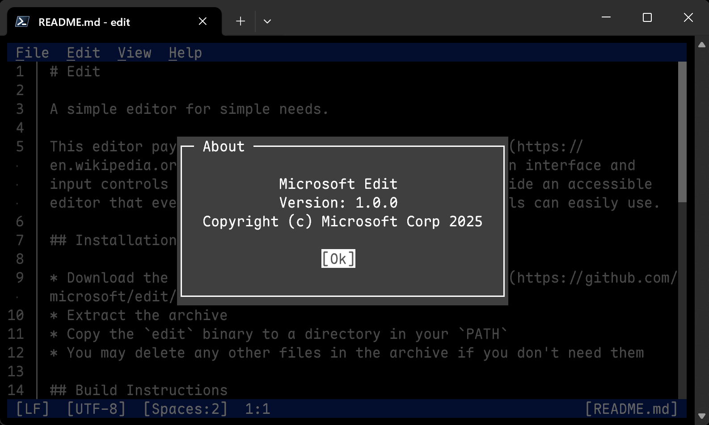

#  Edit

A simple editor for simple needs.

This editor pays homage to the classic [MS-DOS Editor](https://en.wikipedia.org/wiki/MS-DOS_Editor), but with a modern interface and input controls similar to VS Code. The goal is to provide an accessible editor that even users largely unfamiliar with terminals can easily use.



## Installation

* Download the latest release from our [releases page](https://github.com/microsoft/edit/releases/latest)
* Extract the archive
* Copy the `edit` binary to a directory in your `PATH`
* You may delete any other files in the archive if you don't need them

### WinGet (Windows)

* Open up a terminal of your choice and run the following command:
  ```powershell
  winget install Microsoft.Edit
  ```
* `edit` will be automatically added to your `PATH`. If typing `edit` doesn't work, open a new terminal.

## Build Instructions

* [Install Rust](https://www.rust-lang.org/tools/install)
* Install the nightly toolchain: `rustup install nightly`
  * Alternatively, set the environment variable `RUSTC_BOOTSTRAP=1`
* Clone the repository
* For a release build, run: `cargo build --config .cargo/release.toml --release`
